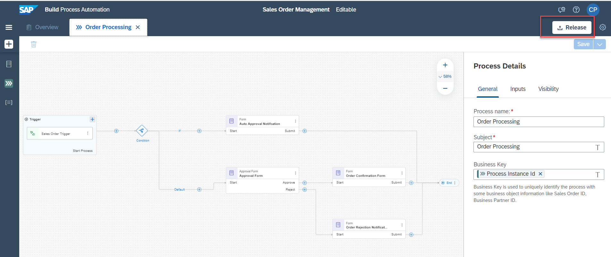
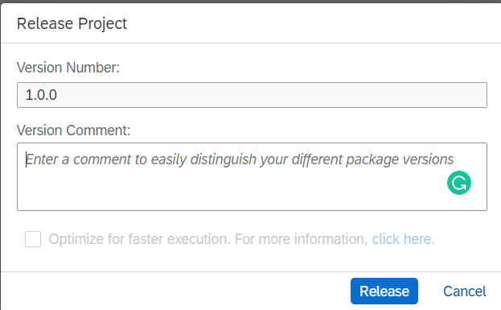

### Table of Contents
- [Release business process project](#releaseproject)
- [Deploy released project](#deployproject)
- [Run business process](#businessprocess)
- [Monitoring the process flow](#processflow)
- [Accessing the tasks](#accessingtask)

# Step 1  
## Release business process project 
 
To run the process you have to first release and then deploy the business process project. 

Releasing a project creates a version or snapshot of the changes and deploying the project makes it available in runtime to be consumed. You can only deploy a released version of the project, and at a given time there can be multiple deployed versions of the same project.  
1. In the Process Builder, to release a project, choose the<b>Release</b> button on the top-right corner of the screen and provide a description.  
     

Version have x.y.z format where x is a major version number, y is minor and z is the patch number. Every time you release, a new version will be created. Version is incremented automatically based on how you want to store the changes in the repository like major or minor update or just as a patch.    
 

2. If you are releasing for the first time, then the version will start with 1.0.0. Next time you release, the version numbers will be automatically updated. 
     

 

